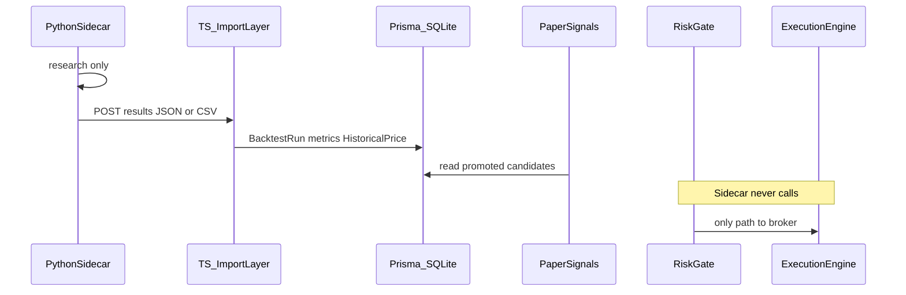

# Future Python Sidecar (Design Only)

Design document per un **sidecar Python opzionale** dedicato a research e backtesting avanzato.

**Stato attuale:** non implementato. Nessun processo Python fa parte del runtime Seb Capital System.

**Regola assoluta:** il sidecar è **read-only dal punto di vista trading**. Non chiama broker, non piazza ordini, non bypassa il Risk Gate TypeScript.

---

## Purpose and boundaries

### Cosa fa

- Research quantitativo pesante (parameter search, walk-forward, strategy comparison).
- Validazione event-driven su dati storici normalizzati.
- Produzione di artefatti importabili: metriche backtest, trade list simulati, candidate signals, ranking parametri.

### Cosa non fa

- Connessione ad Alpaca, exchange crypto o qualsiasi broker.
- Esecuzione MOCK, PAPER o LIVE.
- Scrittura diretta su tabelle ordini (`OrderIntent`, `ExecutionLog`).
- Accesso a `LIVE_TRADING_PASSPHRASE`, `ENABLE_LIVE_TRADING`, `ALPACA_*`.

### Perché un sidecar e non Python in-app

- VectorBT, Backtrader e Zipline sono ecosystem Python — non appartengono al runtime Next.js.
- Isolamento di failure: crash del sidecar non compromette execution o audit.
- TypeScript resta **unica fonte di verità** per risk, journal, execution e audit.

---

## Suggested responsibilities

| Area | Tool di riferimento | Output verso Seb Capital System |
|------|--------------------|---------------------------------|
| Parameter research | VectorBT | Grid di metriche, heatmap parametri, ranking |
| Event-driven validation | Backtrader / Zipline-style | Trade list simulata, equity curve, OOS folds |
| Data normalization | Custom + Zipline principles | OHLCV allineato a `HistoricalPrice` / `PriceBar` |
| Strategy comparison | VectorBT + custom | Tabella comparativa multi-strategia |
| Out-of-sample testing | Walk-forward | Folds IS/OOS (parallelo a `lib/backtesting/walkForward.ts`) |
| Walk-forward analysis | VectorBT / custom | Aggregate metrics per fold |

Il backtest **primario** per decisioni operative resta `lib/backtesting/` in TypeScript. Il sidecar è un **secondo motore di verifica**, non un sostituto.

---

## Integration boundary

TypeScript rimane il gatekeeper. Il sidecar comunica solo tramite un **import layer** server-side.



### Punti di integrazione futuri (design)

| Esistente oggi | Estensione futura |
|----------------|-------------------|
| `POST /api/research/import` — import CSV storico → `HistoricalPrice` | Stesso pattern per batch OHLCV dal sidecar |
| `POST /api/backtests` — crea `BacktestRun` via UI | `POST /api/backtests/import` — import risultati sidecar (Zod + audit) |
| `lib/paper-signals/` — promotion e monitor | Import metriche OOS come input; **promotion resta in TS** |
| `AuditLog` | Nuova action `RESEARCH_SIDECAR_IMPORT` |

Nessuno di questi endpoint sidecar-specifici esiste ancora. Vanno progettati con CSRF, auth server-to-server e validazione Zod come le route mutanti esistenti.

---

## Import contract (sketch)

Payload JSON proposto per import backtest/research (versione 1, design only):

```json
{
  "sidecarVersion": "1.0.0",
  "engine": "vectorbt",
  "strategyId": "preset-dca_monthly",
  "parameters": { "monthlyAmountEur": 250 },
  "period": {
    "startDate": "2024-01-01",
    "endDate": "2025-12-31"
  },
  "metrics": {
    "totalReturnPct": 12.4,
    "maxDrawdownPct": 8.2,
    "sharpeRatio": 1.1,
    "tradeCount": 24
  },
  "walkForward": {
    "foldCount": 4,
    "avgOutOfSampleReturnPct": 6.1
  },
  "trades": [
    {
      "date": "2024-03-01",
      "side": "BUY",
      "symbol": "SWDA",
      "quantity": 2.5,
      "price": 85.0,
      "simulated": true
    }
  ],
  "warnings": ["Insufficient bars for fold 4"],
  "dataProvenance": {
    "source": "sidecar-vectorbt",
    "timestamp": "2026-06-18T12:00:00Z",
    "staleness": "fresh"
  }
}
```

Regole del contratto:

- Ogni record dati include `source`, `timestamp` e stato `staleness` (`fresh` | `stale` | `missing` | `manual`).
- `simulated: true` obbligatorio su ogni trade del sidecar.
- Nessun campo `brokerOrderId` reale — solo ID simulati prefissati (es. `sidecar_*`).
- Il import layer TS valida, rifiuta payload malformati e scrive `AuditLog`.

---

## Security and operations

### Auth

- Sidecar → Seb Capital System: API key server-to-server o mTLS.
- Sidecar **non** esposto su internet pubblico; raggiungibile solo da localhost o rete privata.
- Stesso livello di protezione di `APP_PASSWORD` / CSRF sulle route mutanti (o token dedicato sidecar).

### Env isolation

Variabili **vietate** nel sidecar:

- `LIVE_TRADING_PASSPHRASE`
- `ENABLE_LIVE_TRADING`
- `ALPACA_API_KEY` / `ALPACA_API_SECRET`
- Qualsiasi credenziale broker

Variabili **ammesse**:

- Path DB read-only o export CSV (preferibile: sidecar non legge DB direttamente, riceve CSV export).
- API key sidecar dedicata (solo import research).

### Ops

- Rate limit sull'endpoint import.
- Audit obbligatorio per ogni import (`RESEARCH_SIDECAR_IMPORT`).
- Log strutturato: engine, strategyId, row count, warnings.

---

## Deployment sketch (future)

```
┌─────────────────────┐     JSON/CSV      ┌──────────────────────────┐
│  Python Sidecar     │ ───────────────►  │  Seb Capital System      │
│  (Docker / venv)    │   localhost only  │  Next.js + Prisma        │
│  VectorBT / BT / ZL │                   │  Import API + AuditLog   │
└─────────────────────┘                   └──────────────────────────┘
         │                                           │
         │ no broker SDK                             │ Risk Gate → Execution
         ▼                                           ▼
    (research only)                            (trading authority)
```

---

## Explicit non-goals

- Sostituire `lib/backtesting/` per ordini MOCK/PAPER operativi.
- Esecuzione LIVE o PAPER dal Python.
- Auto-promotion strategia a LIVE basata su metriche sidecar.
- Sincronizzazione bidirezionale con Lean, NautilusTrader o Freqtrade runtime.
- Market making o connettori exchange (dominio Hummingbot — fuori scope).

---

## Documenti correlati

- [Reference Architecture](./reference-architecture.md) — cosa imparare da VectorBT, Backtrader, Zipline
- [Architecture Rules](./architecture-rules.md) — regola 7: Python engine read-only
