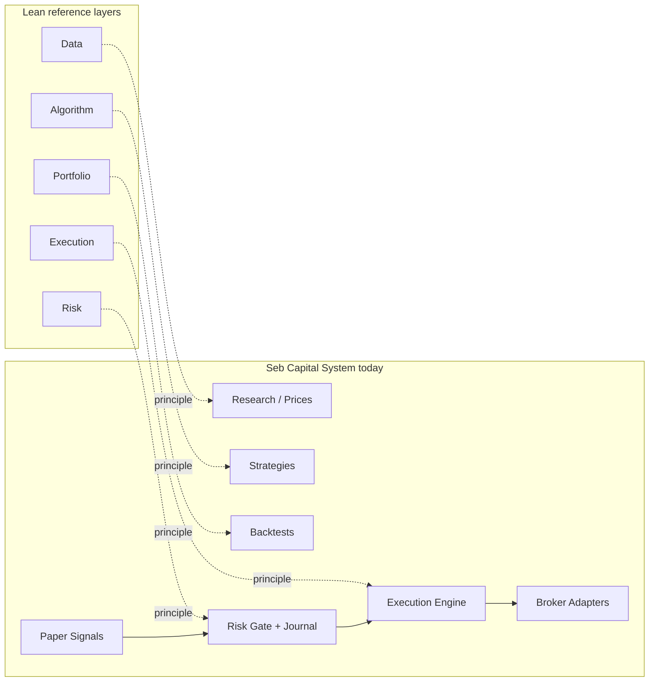

# Reference Architecture

Documento di allineamento concettuale tra **Seb Capital System** e otto repository open-source di riferimento nel mondo quant/trading.

**Regola:** questo documento descrive cosa imparare da ciascun progetto. Non autorizza integrazioni dirette, copia di codice o rewrite in Python.

---

## Riepilogo

| Repository | Ruolo di riferimento | Timing |
|------------|---------------------|--------|
| [alpacahq/alpaca-py](https://github.com/alpacahq/alpaca-py) | Broker adapter, account sync, paper/live execution | **Later** |
| [freqtrade/freqtrade](https://github.com/freqtrade/freqtrade) | Dry-run, strategy lifecycle, crypto risk controls | **Later** (dry-run); **Never** (esecuzione diretta) |
| [polakowo/vectorbt](https://github.com/polakowo/vectorbt) | Research engine, parameter search, fast backtesting | **Later** |
| [mementum/backtrader](https://github.com/mementum/backtrader) | Modello mentale strategy/backtest | **Later** |
| [stefan-jansen/zipline-reloaded](https://github.com/stefan-jansen/zipline-reloaded) | Backtest event-driven, pipeline dati | **Later** |
| [nautechsystems/nautilus_trader](https://github.com/nautechsystems/nautilus_trader) | Architettura event-driven professionale | **Later** |
| [QuantConnect/Lean](https://github.com/QuantConnect/Lean) | Separazione istituzionale data/algorithm/portfolio/risk/execution | **Later** (modello #1) |
| [hummingbot/hummingbot](https://github.com/hummingbot/hummingbot) | Connector exchange, market making crypto | **Never** (fase attuale) |

---

## alpacahq/alpaca-py

### A cosa serve

SDK Python ufficiale per Alpaca Markets: account, posizioni, ordini, streaming, distinzione paper vs live.

### Principio da adottare

- **Contratto broker unificato:** account sync, posizioni, place/cancel order, mapping errori.
- **Separazione paper/live** via base URL e credenziali distinte — mai mischiare ambienti.
- **Idempotency e tracciabilità** degli ordini lato adapter, non sparsa nella UI.

In Seb Capital System questo principio vive in `lib/brokers/` (adapter TS) e `BrokerAccountSnapshot`.

### Cosa non copiare

- Importare alpaca-py in-process o duplicare la logica ordini fuori da `lib/brokers/`.
- Esporre API key Alpaca al client o a processi di research.
- Bypassare `lib/execution/` chiamando Alpaca da script esterni.

### Timing: **Later**

Riferimento utile quando si estende l'adapter TypeScript esistente (`lib/brokers/alpaca-broker.ts`). Il pattern account sync è già parzialmente presente via `POST /api/broker/sync`.

---

## freqtrade/freqtrade

### A cosa serve

Bot crypto open-source con backtest, **dry-run** (simulazione live senza ordini reali), gestione strategie e controlli di rischio per-trade.

### Principio da adottare

- **Lifecycle esplicito:** backtest → paper/dry-run → live (solo se tutti i gate passano).
- **Stato strategia** visibile (DRAFT, BACKTESTED, PAPER, PROMOTED) — già allineato a `Strategy.status` in Seb Capital System.
- **Dry-run come disciplina:** simulare esecuzione senza toccare capitale reale.

### Cosa non copiare

- Architettura monolitica bot+crypto exchange wiring.
- Esecuzione diretta da segnale a exchange.
- Bypass del Risk Gate TypeScript o del journal obbligatorio.

### Timing: **Later** (dry-run mental model) / **Never** (esecuzione diretta)

Il modello dry-run informa paper signals e monitor. Freqtrade non deve mai diventare il motore di esecuzione di Seb Capital System.

---

## polakowo/vectorbt

### A cosa serve

Framework Python per backtesting vettoriale veloce, parameter search, analisi di portafogli e strategie su serie storiche.

### Principio da adottare

- **Separazione research vs execution:** VectorBT produce metriche e ranking parametri; non ordini.
- **Grid search / heatmap** per confrontare configurazioni strategia prima della promotion paper.
- **Metriche aggregate** (return, drawdown, Sharpe-like) come input alla decisione umana.

### Cosa non copiare

- Integrare VectorBT dentro Next.js o sostituire `lib/backtesting/` per ordini mock/paper.
- Collegare output VectorBT direttamente al broker.
- Accoppiare segnali generati in Python al path LIVE senza passare da Risk Gate TS.

### Timing: **Later**

Candidato principale per il [future Python sidecar](./future-python-sidecar.md) (solo research).

---

## mementum/backtrader

### A cosa serve

Framework Python classico: Strategy → Cerebro → Analyzers, con indicatori composabili e feed storici.

### Principio da adottare

- **Modello mentale semplice:** strategia pura, motore di simulazione separato, analyzer per metriche.
- **Indicatori riusabili** come building block — analogo a funzioni pure in `lib/strategies/`.
- **Validazione event-driven** bar-by-bar come secondo motore di verifica (cross-check con TS backtest).

### Cosa non copiare

- Runtime Backtrader embedded nell'app Next.js.
- Feed live integrato che genera ordini.
- Duplicare la pipeline ordini esistente in Python.

### Timing: **Later**

Utile nel sidecar Python per validazione event-driven su stessi dati di `HistoricalPrice`.

---

## stefan-jansen/zipline-reloaded

### A cosa serve

Fork mantenuto di Zipline: backtest event-driven, pipeline dati, calendar, bundles, attenzione al look-ahead bias.

### Principio da adottare

- **Event-driven simulation:** ogni bar processed in ordine temporale, niente peeking nel futuro.
- **Pipeline dati normalizzata** (OHLCV, adjustment, timezone) — allineata a `lib/prices/history.ts` e import CSV.
- **Out-of-sample rigoroso** come prerequisito promotion paper.

### Cosa non copiare

- Deploy dello stack Zipline completo in produzione TypeScript.
- Sostituire il Risk Gate o l'execution engine con componenti Zipline.
- Bundle management complesso se non serve al caso d'uso personale.

### Timing: **Later**

Ispirazione per normalizzazione barre e OOS nel sidecar; il backtest primario resta `lib/backtesting/`.

---

## nautechsystems/nautilus_trader

### A cosa serve

Piattaforma event-driven professionale (Rust core + Python): messaggi, cache, adapter isolati, live e backtest unificati.

### Principio da adottare

- **Adapter isolati** per ogni fonte dati o venue — stesso pattern di `lib/brokers/types.ts`.
- **Messaggistica esplicita** tra componenti (data, strategy, execution) senza accoppiamento.
- **Modularità production-grade** come benchmark architetturale.

### Cosa non copiare

- Adottare l'intero runtime Nautilus (complessità e stack Rust/Python).
- Sostituire SQLite/Prisma con l'infrastruttura Nautilus.
- Live trading via Nautilus bypassando Seb Capital System.

### Timing: **Later**

Benchmark di modularità per sidecar e broker adapter; non integrazione diretta.

---

## QuantConnect/Lean

### A cosa serve

Engine istituzionale open-source (C# core): separazione netta tra Data, Algorithm, Portfolio, Risk, Execution e Results. Usato da QuantConnect cloud.

### Principio da adottare

- **Layer boundaries rigorosi** — modello di riferimento #1 per Seb Capital System:

```
Data → Algorithm → Portfolio → Risk → Execution → Results/Audit
```

- Ogni layer ha responsabilità singola; nessun algorithm chiama il broker.
- **Portfolio state** separato dalla logica strategia — analogo a `lib/portfolio/` vs `lib/strategies/`.
- **Risk come gate** prima dell'execution, non come afterthought.

### Cosa non copiare

- Deploy Lean Engine o rewrite in C#.
- Cloud QuantConnect come runtime obbligatorio.
- Duplicare tutta la superficie Lean (data feed, brokerage model, cloud sync).

### Timing: **Later**

Principi guida permanenti; implementazione resta TypeScript/Next.js.

---

## hummingbot/hummingbot

### A cosa serve

Bot open-source per market making e arbitraggio crypto, con connettori multi-exchange e gestione order book.

### Principio da adottare

- **Connettori exchange come adapter** (concetto utile in futuro fase crypto avanzata).
- **Order book awareness** per strategie che richiedono profondità di mercato.

### Cosa non copiare

- Market making autonomo o esecuzione HFT.
- Connettori exchange che bypassano Risk Gate e journal.
- Integrazione Hummingbot come motore di esecuzione.

### Timing: **Never** (fase attuale)

Solo note per un eventuale futuro crypto avanzato. Non rilevante per MOCK/PAPER attuale.

---

## Mapping to Seb Capital System

| Layer Lean-style | Modulo Seb Capital System | Path |
|------------------|---------------------------|------|
| Data | Research, Prices, Historical import | `lib/research/`, `lib/prices/`, `POST /api/research/import` |
| Algorithm | Strategies (pure functions) | `lib/strategies/` |
| Portfolio | Portfolio, backtest state | `lib/portfolio/`, `lib/backtesting/` |
| Paper / dry-run | Paper signals, promotion | `lib/paper-signals/`, `/signals` |
| Risk | Risk Gate + Journal | `lib/risk/gate.ts`, `lib/journal/`, `lib/security/` |
| Execution | Execution engine | `lib/execution/` |
| Broker | Broker adapters | `lib/brokers/` |
| Results / Audit | Audit log, execution logs, reports | `AuditLog`, `ExecutionLog`, `lib/reports/` |

### Confronto layer



---

## Documenti correlati

- [Architecture Rules](./architecture-rules.md) — regole obbligatorie
- [Future Python Sidecar](./future-python-sidecar.md) — design research engine opzionale
